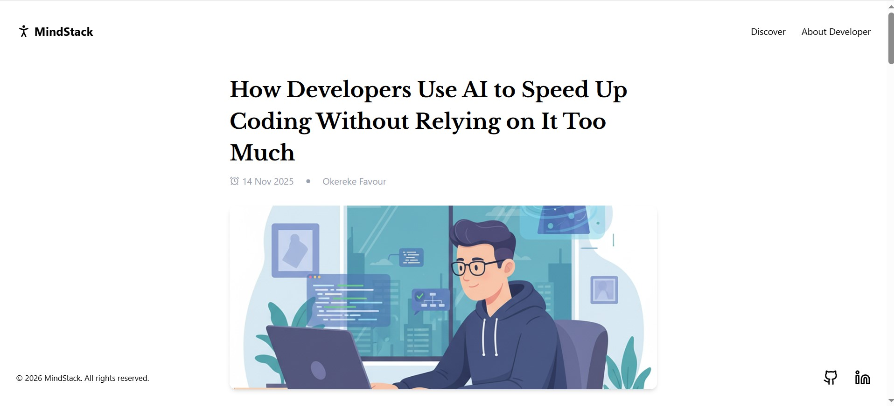

# MindStack — Headless CMS Blog Platform 🧠📝

A modern content-driven blog application built with **React**, **TypeScript**, **Tailwind CSS**, and **Contentful Headless CMS**.  
MindStack showcases a scalable blog architecture with dynamic content fetching, clean component design, and a responsive reading experience.

🔗 **Live Demo:** https://mindstack-nine.vercel.app/  
📦 **Repository:** https://github.com/ojaraa/mindstack

---

## 🧩 Project Overview

MindStack is a **content publishing platform** built as a portfolio project to demonstrate how to:

- Fetch and render content from a **headless CMS** (Contentful)
- Build a **type-safe React + TypeScript frontend**
- Use modern tooling like **Vite** and **Tailwind CSS**
- Deploy a static frontend to **Vercel**

Unlike static content, this blog dynamically retrieves content from Contentful, allowing real posts to be written, managed, and published without code changes.

This is the kind of system used by real companies for blogs, news feeds, marketing sites, and documentation sites.

---

## ✨ Core Features

### 📰 Blog Functionality
- Dynamic blog listing from Contentful
- Article detail pages with rich text rendering
- Search and filtering (if implemented)
- SEO-ready page structure

### 🛠 Tech Highlights
- **React + TypeScript:** Strong type safety and component design
- **Tailwind CSS:** Utility-first responsive UI
- **Contentful CMS:** Headless content management
- **Vite:** Fast development experience & optimized builds
- **Vercel Deployment:** Continuous deployment from GitHub

---

## 📸 Screenshots

